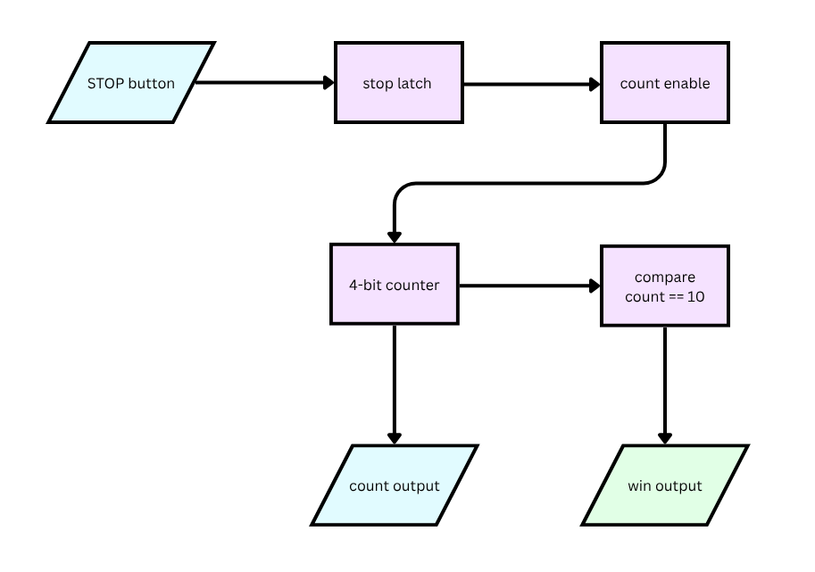

# Stop the Clock — Structural Verilog ASIC Design 

A single-player reaction game implemented as a custom digital ASIC following the [Tiny Tapeout](https://tinytapeout.com) workflow. 

A 4-bit counter increments on every clock edge. The player presses **STOP** to freeze the count — land exactly on **10** and a `win` output goes high. Built from scratch in structural Verilog: no behavioral counters, no `+`/`-` operators, every adder and flip-flop is hand-instantiated gate logic.


## How it works

On reset, an internal 4-bit counter starts at `0` and increments every clock cycle. The `stop` input is sampled and latched — once pressed, the latch holds and the counter freezes at its current value. If that value is exactly `10`, the `win` output is asserted; otherwise the round is a loss. A reset clears both the counter and the win latch.

<p align="center">
    
</p>

### Module hierarchy

| Module | Role |
|---|---|
| `src/tt_um_alexijustine_stop_the_clock.v` | Top-level TT wrapper: stop latch, win comparator, pin mapping |
| `src/counter4.v` | 4-bit up/down counter with synchronous load and clock enable |
| `src/addsub8.v` | 4-bit adder/subtractor (two's-complement, via conditional invert) |
| `src/fulladder4.v` | 4-bit ripple-carry full adder with overflow detection |

### Pinout

| Pin | Direction | Function |
|---|---|---|
| `ui_in[0]` | input | STOP button |
| `uo_out[3:0]` | output | Live counter value (0–15) |
| `uo_out[4]` | output | `win` flag — high when stopped at exactly 10 |
| `rst_n` | input | Active-low reset |

(Unused `ui_in`, `uio`, and high `uo_out` bits are tied off.)

## Testing

Verified with a [cocotb](https://docs.cocotb.org/en/stable/) testbench (`test/test.py`) simulating the gate-level design directly — no physical hardware required:

1. **Lose case** — STOP pressed at count `5`: counter holds at 5, `win` stays low.
2. **Win case** — STOP pressed at count `10`: counter holds at 10, `win` goes high.
3. **Hold behavior** — counter does not resume incrementing after STOP is released.
4. **Reset** — clears both the counter and the win flag back to 0.

```sh
cd test
pip install -r requirements.txt
make -B                            # run RTL simulation
gtkwave tb.fst tb.gtkw             # inspect waveforms in a GUI
```

CI runs RTL simulation, gate-level (post-synthesis) simulation, and a full [LibreLane](https://www.zerotoasiccourse.com/terminology/librelane/) hardening build on every push — see the badges above.

## Repo layout

```
src/
  tt_um_alexijustine_stop_the_clock.v   top-level module
  counter4.v                            4-bit counter
  addsub8.v                             adder/subtractor
  fulladder4.v                          ripple-carry adder
test/
  test.py                               cocotb testbench
  tb.v, tb.gtkw                         simulation harness, waveform config
docs/info.md                            project datasheet (rendered on the TT website)
info.yaml                               TT project metadata, pin descriptions, build config
```

## Background
Built for UC Santa Cruz's Intro to VLSI coursework, this project was designed to meet Tiny Tapeout design requirements and replicate a realistic ASIC development workflow. The project focused on low-level hardware design fundamentals, including flip-flop design, ripple-carry arithmetic, combinational logic, and structural RTL development without relying on Verilog’s built-in arithmetic operators. The final design follows a professional digital hardware workflow, including simulation, synthesis, verification, and physical layout generation.
